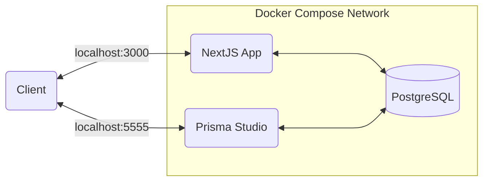

# PiXell - Collaborative Visual Art Editor

PiXell is a collaborative visual art editor in which images can be edited one PiXell at a time.

<details>
<summary>Table of contents</summary>

- [Links](#links)
- [Folder structure](#folder-structure)
- [Environment variables](#environment-variables)
- [Development](#development)
  - [Docker Compose architecture](#docker-compose-architecture)
  - [Running the application](#running-the-application)
  - [Database migrations](#database-migrations)
  - [Installing new npm packages](#installing-new-npm-packages)
  - [Prisma Studio](#prisma-studio)
- [Testing and linting](#testing-and-linting)
- [Other remarks](#other-remarks)
  - [Development with VS Code](#development-with-vs-code)

</details>

## Links

Useful external links are listed below.

- [Production](http://ec2-34-244-31-204.eu-west-1.compute.amazonaws.com/)

## Folder structure

General folder structure of the repository.

```
.
├── README.md                       # General documentation
├── docker-compose.yml              # Docker Compose file for development
├── app                             # NextJS application source code and documentation
│   ├── Dockerfile                  # Dockerfile for NextJS application
│   ├── README.md                   # Specific documentation for NextJS application
│   ├── prisma                      # Prisma database files
│   │   ├── schema.prisma           # Database schema
│   │   ├── migrations              # Database migration files
│   └── src                         # Source code of the NextJS application
└── config                          # Configuration files for each environment
    ├── development                 # Development configuration
    ├── production                  # Production configuration
```

## Environment variables

Below are listed all of the environment variables that the different parts of the application needs.

| Environment Variable | Description                   |
| -------------------- | ----------------------------- |
| DATABASE_URL         | PostgreSQL connect URL string |

## Development

Docker is needed to develop the application. Install instructions for Docker can be found [here](https://docs.docker.com/get-docker/).

Docker Compose file in the root directory defines all the containers that are used in development environment. Environment variables for the development environment are defined in the config folder.

### Docker Compose architecture



### Running the application

You can easily run all the required containers by one command with docker compose.

```sh
# Start the application
docker compose up

# Shutdown the application and remove the containers
docker compose down

# Rebuild the docker images
docker compose build
```

### Database migrations

Database migrations are ran automatically on the first time the containers are started with docker compose. If the migrations fail because the database is not running yet, you must manually start the database before running the migrations. After updating the schema.prisma file, a new migration file must be created so that the database schema is updated also in the staging and production environments.

```sh
# Start the postgres db
docker compose up postgres --detach

# Run the migrations and seed the db
docker compose up prisma-migrate-dev

# Start all the other containers after migrations and the seeding are done
docker compose up

# Create a new migration after changes are done to the schema
docker compose exec app npm run prisma migrate dev -- --name="name_for_the_migration"

# Drop the development database
docker compose down --volumes
```

### Installing new npm packages

New npm packages can be installed by two ways. Either by installing the package straight inside the container or dropping the containers and building the docker images again after installing the new npm package locally.

```sh
# Install a new npm package straight inside the running container
docker compose exec app npm install [--options] <package_name>

# Or drop the containers
docker compose down

# Install npm package locally
cd app && npm install [--options] <package_name> && cd ..

# And rebuild the images
docker compose build
```

### Prisma Studio

Prisma Studio is used to browse and modify data in PostgreSQL database. Navigate to [http://localhost:5555](http://localhost:5555) to open the Prisma Studio.

## Testing and linting

In the current development phase of the application the testing is implemented only by running the type checks by TypeScript compiler and checking the linter rules with ESLint.
You can run the type checking and linting by to ways, either inside the container, or locally in the app directory.

```sh
# Run the tsc type checking and ESLint linter in the container
docker compose exec app npm run lint

# Run the tcs type checking and ESLint linter locally in the app folder
npm run lint
```

## Other remarks

### Development with VS Code

After cloning the repository `npm install` must be run on the app folder before using docker compose -commands. This is required so that the node_modules folder gets required permissions.

VS Code will output TypeScript errors if you have not installed all the required npm packages locally. For that reason `npm install` has to be ran locally after new npm package(s) has been installed inside the corresponding docker container.
